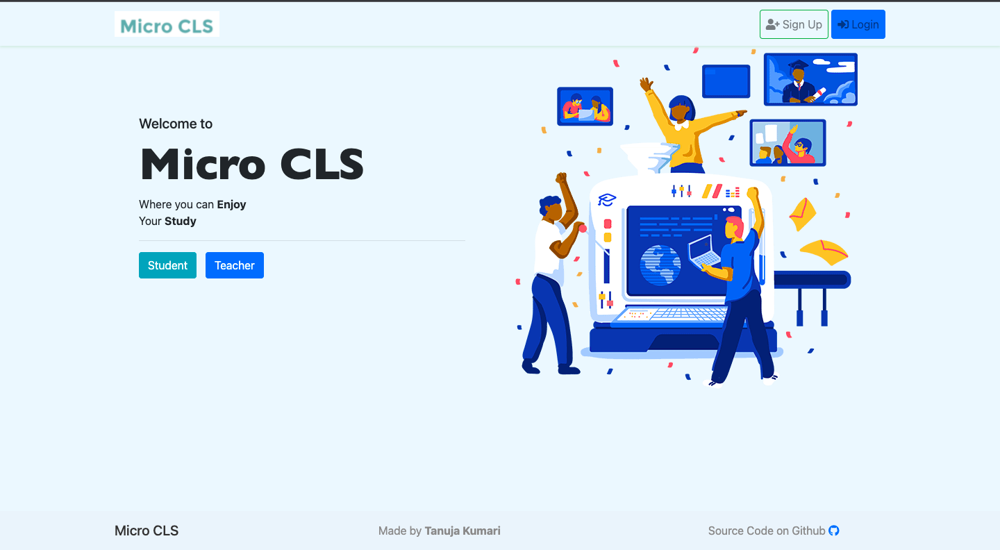

   
 
<h1> Micro cls ( Microsoft Engage Assignment )</h2>

 

 
This is the project for helping student evaluation. The webapp is similar to google classroom where students and teachers can interact. The students can post their assignments and give tests whereas the teachers can create classroom and post assignments.

Tanuja Kumari
tanujasangwan@gmail.com
OR
tanujakumari_2k18co370@dtu.ac.in
# Micro-Classes
# Micro-Classes
